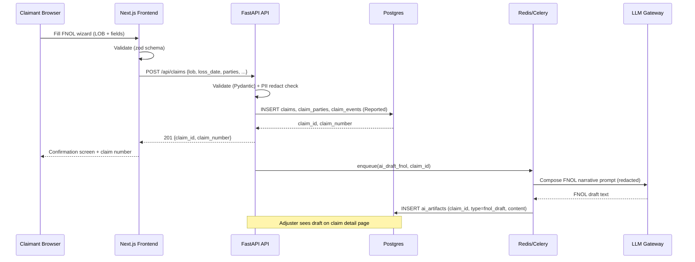
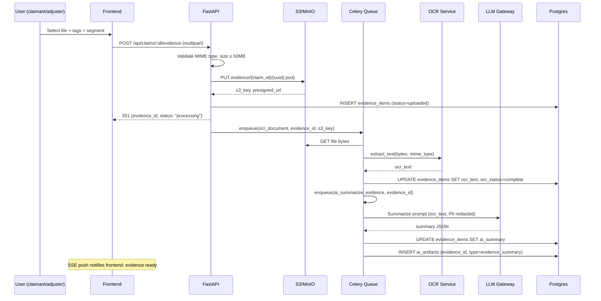
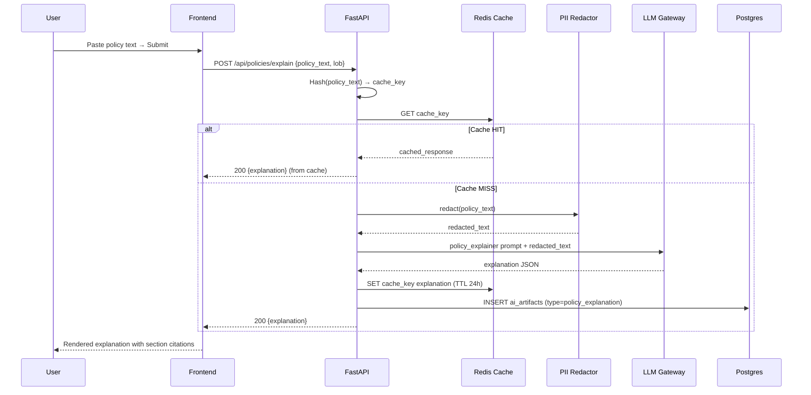

# Architecture — Insurance Claim Assistant

**Version:** 1.0  
**Date:** 2025-01-01

---

## 1. System Overview

The system is a **three-tier web application** with a React/Next.js frontend, a FastAPI Python backend, and a Postgres datastore. Background workers handle asynchronous tasks (OCR, AI summarization). An LLM gateway abstracts provider selection behind a single interface.

```
┌─────────────────────────────────────────────────────────────────────────────┐
│                              CLIENT TIER                                     │
│  Browser / PWA                                                               │
│  Next.js 14 (App Router) · TypeScript · Tailwind CSS · shadcn/ui            │
│  react-hook-form + zod · Tanstack Query · Socket.io-client (status push)    │
└────────────────────────────┬────────────────────────────────────────────────┘
                             │ HTTPS / REST + SSE
┌────────────────────────────▼────────────────────────────────────────────────┐
│                              API TIER                                        │
│  FastAPI (Python 3.12)  ·  Uvicorn  ·  Gunicorn (prod)                      │
│  ┌──────────────┐ ┌──────────────┐ ┌──────────────┐ ┌──────────────────┐   │
│  │  /api/auth   │ │ /api/claims  │ │/api/evidence │ │/api/ai  /timelines│  │
│  └──────────────┘ └──────────────┘ └──────────────┘ └──────────────────┘   │
│  ┌─────────────────────────────────────────────────────────────────────┐    │
│  │  Services: ai_service · ocr_service · timeline_service              │    │
│  │  Core:     config · db (SQLAlchemy 2.0) · security (JWT/RBAC)       │    │
│  └─────────────────────────────────────────────────────────────────────┘    │
└──────┬──────────────┬──────────────────────┬────────────────────────────────┘
       │              │                      │
┌──────▼──────┐ ┌─────▼───────┐ ┌───────────▼──────────┐
│  Postgres   │ │   Redis     │ │   S3-compatible        │
│  (Primary   │ │  (Celery    │ │   Blob Store           │
│   Data)     │ │   Broker +  │ │   (MinIO local /       │
│             │ │   Cache)    │ │    AWS S3 prod)         │
└─────────────┘ └─────┬───────┘ └───────────────────────┘
                      │
               ┌──────▼──────────────────────────────┐
               │        WORKER TIER                   │
               │  Celery Workers (Python)              │
               │  Tasks:                               │
               │  · ocr_document (Tesseract / Textract)│
               │  · ai_summarize_evidence             │
               │  · ai_draft_fnol                     │
               │  · notify_status_change               │
               └──────┬──────────────────────────────┘
                      │
               ┌──────▼──────────────────────────────┐
               │        LLM GATEWAY                   │
               │  Abstraction layer (LLM_PROVIDER env)│
               │  ┌──────────┐ ┌──────────┐ ┌──────┐ │
               │  │ OpenAI   │ │Anthropic │ │ Mock │ │
               │  │ (GPT-4o) │ │(Claude 3)│ │(stub)│ │
               │  └──────────┘ └──────────┘ └──────┘ │
               └─────────────────────────────────────┘
```

---

## 2. Component Inventory

| Component | Technology | Role |
|-----------|-----------|------|
| Frontend | Next.js 14, TypeScript, Tailwind, shadcn/ui | Claimant & adjuster UI |
| API Server | FastAPI 0.111, Python 3.12, SQLAlchemy 2.0 | Business logic, REST endpoints |
| Auth | JWT (HS256) + Auth0-ready JWKS verify | AuthN/AuthZ; RBAC (claimant/adjuster/broker/admin) |
| Database | PostgreSQL 16 (SQLite for local dev) | Claims, users, evidence metadata, audit log |
| Blob Store | AWS S3 / MinIO (local) | Evidence files (photos, PDFs, videos) |
| Cache / Queue | Redis 7 | Celery task broker, API response cache, session store |
| Background Worker | Celery 5 + Redis | Async: OCR, AI summarization, notifications |
| OCR | Tesseract 5 (local) / AWS Textract (prod) | Text extraction from evidence files |
| LLM Gateway | Custom abstraction (ai_service.py) | OpenAI / Anthropic / Mock provider |
| Observability | Structlog + Prometheus + Grafana (optional) | Structured logging, metrics |

---

## 3. Data Flows

### 3a. New Claim Intake (FNOL)



### 3b. Evidence Upload + OCR + AI Summary



### 3c. Policy Explainer



### 3d. Status Update + AI Rationale

```mermaid
sequenceDiagram
    participant ADJ as Adjuster
    participant FE as Frontend
    participant API as FastAPI
    participant DB as Postgres
    participant Q as Celery
    participant LLM as LLM Gateway

    ADJ->>FE: Change stage → "Coverage Evaluation"
    FE->>API: PATCH /api/claims/:id/events {new_stage, note}
    API->>API: Validate stage transition (FSM rules)
    API->>DB: INSERT claim_events (stage, timestamp, actor)
    API->>DB: UPDATE claims SET current_stage
    API->>Q: enqueue(ai_status_rationale, claim_id, new_stage)
    Q->>DB: SELECT claim context (parties, LOB, events, evidence)
    Q->>LLM: status_rationale prompt
    LLM-->>Q: rationale + next_actions JSON
    Q->>DB: INSERT ai_artifacts (type=status_rationale)
    Q->>DB: INSERT ai_artifacts (type=next_actions)
    Note over FE: SSE push updates claimant status board
    API-->>FE: 200 {event_id, stage}
    FE-->>ADJ: Stage updated; AI rationale generating…
```

---

## 4. Security Architecture

### 4.1 Authentication & Authorization

```
Request → TLS Termination → JWT Validation Middleware
                                     │
                              ┌──────▼──────┐
                              │  RBAC Check │
                              │  roles:     │
                              │  · claimant │ ─ own claims only
                              │  · adjuster │ ─ assigned claims
                              │  · broker   │ ─ client claims
                              │  · admin    │ ─ all
                              └─────────────┘
```

JWT payload includes: `sub` (user_id), `role`, `org_id`, `exp`.

### 4.2 PII Redaction Pipeline

All text sent to LLM passes through `pii_redactor.py`:
```
Input Text
    │
    ▼ Regex patterns:
    · SSN: \b\d{3}-\d{2}-\d{4}\b → [SSN_REDACTED]
    · DL:  \b[A-Z]\d{7}\b        → [DL_REDACTED]
    · Policy#: \b[A-Z]{2}\d{8,10}\b → [POLICY_REDACTED]
    · Credit card: \b\d{4}[- ]\d{4}[- ]\d{4}[- ]\d{4}\b → [CC_REDACTED]
    · DOB: various date patterns flagged near "born"/"DOB" → [DOB_REDACTED]
    · PHI NPI: \b\d{10}\b (medical provider NPI) → [NPI_REDACTED]
    │
    ▼ Redacted Text → LLM
```

Redacted text and original text **never** stored together in the same log record. Original text encrypted at rest. Redacted text used for audit logs.

### 4.3 Data Encryption
- **At rest**: Postgres column-level encryption for `ssn`, `dob`, `policy_number` fields (using `pgcrypto` in prod; env-managed key)
- **In transit**: TLS 1.3+ enforced at load balancer
- **S3**: SSE-S3 (AES-256) on all objects; bucket policy blocks public access

---

## 5. Infrastructure Topology (Production)

```
Internet
    │
    ▼
CloudFront CDN (static assets, Next.js edge)
    │
    ▼
Application Load Balancer (TLS termination)
    ├─► Next.js (ECS Fargate, 2+ tasks)
    └─► FastAPI (ECS Fargate, 2+ tasks)
              │
         ┌────┴────────────────────────────┐
         ▼                                 ▼
    RDS Postgres (Multi-AZ)          ElastiCache Redis
         │
         ▼
    S3 (evidence store, encrypted)
         │
         ▼
    Celery Workers (ECS Fargate, auto-scale)
         │
         ▼
    LLM Provider API (OpenAI / Anthropic)
```

**Local Development** (docker-compose):
- FastAPI + Postgres + Redis + MinIO (S3-compatible) + Celery worker all in one compose file
- SQLite option available for zero-dependency quick start

---

## 6. Backend Directory Structure

```
backend/
├── app/
│   ├── main.py                  # FastAPI app factory, middleware, routers
│   ├── api/
│   │   └── routers/
│   │       ├── auth.py          # POST /api/auth/login, /register, /refresh
│   │       ├── claims.py        # CRUD + stage transitions
│   │       ├── evidence.py      # Upload, tag, retrieve
│   │       ├── policies.py      # Policy explainer
│   │       ├── ai.py            # draft-fnol, next-actions, summarize
│   │       └── timelines.py     # Timeline estimation
│   ├── models/                  # SQLAlchemy ORM models
│   │   ├── user.py
│   │   ├── claim.py
│   │   ├── evidence.py
│   │   └── ai_artifact.py
│   ├── schemas/                 # Pydantic v2 request/response schemas
│   │   ├── claim.py
│   │   ├── evidence.py
│   │   ├── ai.py
│   │   └── auth.py
│   ├── services/
│   │   ├── ai_service.py        # LLM gateway abstraction
│   │   ├── ocr_service.py       # Tesseract / Textract
│   │   ├── timeline_service.py  # Timeline estimation logic
│   │   └── pii_redactor.py      # PII redaction utility
│   ├── core/
│   │   ├── config.py            # Settings (pydantic-settings)
│   │   ├── db.py                # SQLAlchemy engine + session
│   │   └── security.py          # JWT encode/decode, RBAC
│   └── workers/
│       └── tasks.py             # Celery task definitions
├── alembic/                     # DB migrations
├── tests/
│   ├── test_claims.py
│   ├── test_policy_explainer.py
│   └── test_evidence.py
├── requirements.txt
├── .env.example
├── Dockerfile
└── docker-compose.yml
```

---

## 7. Frontend Directory Structure

```
frontend/
├── src/
│   ├── app/
│   │   ├── layout.tsx           # Root layout, auth provider, theme
│   │   ├── page.tsx             # Landing / redirect
│   │   ├── dashboard/
│   │   │   └── page.tsx         # Claim queue + KPI cards
│   │   ├── claims/
│   │   │   ├── new/
│   │   │   │   └── page.tsx     # Multi-step FNOL wizard
│   │   │   └── [id]/
│   │   │       └── page.tsx     # Tabbed claim detail
│   │   └── policy-explainer/
│   │       └── page.tsx         # Policy text → explanation
│   ├── components/
│   │   ├── ui/                  # shadcn/ui component overrides
│   │   ├── wizard/
│   │   │   ├── WizardShell.tsx  # Step container + progress bar
│   │   │   ├── StepLOB.tsx      # Step 1: LOB selector
│   │   │   ├── StepAuto.tsx     # Auto-specific fields
│   │   │   ├── StepHomeowners.tsx
│   │   │   ├── StepGL.tsx
│   │   │   ├── StepParties.tsx  # Insured + claimant info
│   │   │   └── StepReview.tsx   # Review + submit
│   │   └── claim/
│   │       ├── StatusBoard.tsx  # Stage tracker component
│   │       ├── EvidenceUploader.tsx
│   │       └── AIInsightsPanel.tsx
│   ├── lib/
│   │   ├── api.ts               # Typed API client (fetch wrapper)
│   │   └── utils.ts
│   └── types/
│       └── index.ts             # Shared TypeScript types
├── public/
├── tailwind.config.ts
├── tsconfig.json
├── package.json
└── README.md
```

---

## 8. Technology Decisions

| Decision | Choice | Rationale |
|----------|--------|-----------|
| Backend framework | FastAPI | Async-native, automatic OpenAPI docs, Pydantic integration |
| ORM | SQLAlchemy 2.0 (async) | Production-grade, Alembic migrations, Postgres-ready |
| Dev DB | SQLite | Zero-dependency local dev; swap to Postgres via `DATABASE_URL` |
| Task queue | Celery + Redis | Mature ecosystem, retry logic, priority queues |
| LLM abstraction | Custom `ai_service.py` | Avoids LangChain overhead; simple provider swap via env var |
| Auth | JWT (HS256) + Auth0-ready | Simple for MVP; production upgrade path to Auth0 JWKS validation |
| Frontend | Next.js 14 App Router | SSR for SEO on marketing pages; RSC for performance |
| Form management | react-hook-form + zod | Type-safe forms, works with shadcn/ui, minimal re-renders |
| Blob store | MinIO (local) / S3 (prod) | S3-compatible API; no code changes between environments |
