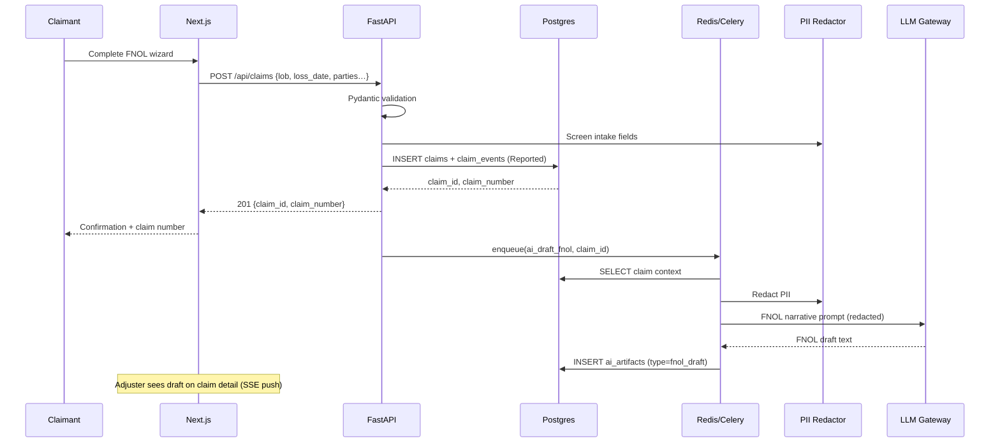

# M2 — Technology, API Architecture, Buy vs. Build & Payment Integration
**Wake Forest FTA-799 Capstone | Insurance Claim Assistant (ICA)**
**Author:** Capstone Researcher | **Date:** 2025 | **Status:** Milestone 2

---

## 1. Key Technologies

The ICA stack is organized into five layers. Every technology selection was evaluated against four criteria: (a) fitness for asynchronous AI workloads, (b) P&C claims-industry compliance posture, (c) total cost of ownership at seed-stage volume, and (d) upgrade path to carrier-grade multi-tenancy.

| Layer | Technology | Version | Rationale | Alternatives Considered |
|-------|-----------|---------|-----------|------------------------|
| **Frontend** | Next.js (App Router) | 14 | SSR for public marketing pages; RSC reduces JS bundle; TypeScript end-to-end | Remix (less mature ecosystem); CRA (SPA-only, no SSR) |
| **Frontend UI** | shadcn/ui + Tailwind CSS | Latest | Unstyled-by-default components, accessible, easily whitelabeled | MUI (larger bundle, opinionated); Chakra UI |
| **Form validation** | react-hook-form + zod | Latest | Type-safe schema validation shared with backend; minimal re-renders | Formik (heavier), Yup alone (no TS inference) |
| **API framework** | FastAPI (Python 3.12) | 0.111 | Async-native, auto-OpenAPI docs, Pydantic integration; Python AI ecosystem | Django REST Framework (sync-first, heavier); Node.js/Express (weaker AI library support) |
| **ORM** | SQLAlchemy 2.0 (async) | 2.0 | Production-grade, Alembic migrations, Postgres-native; async session support | Django ORM (tightly coupled to Django); Prisma (Python client less mature) |
| **Primary DB** | PostgreSQL 16 | 16 | ACID compliance for financial records; pgcrypto for column encryption; jsonb for AI artifact metadata | MySQL 8 (weaker JSON support); MongoDB (sacrifices ACID for claims workflow) |
| **Cache / Queue broker** | Redis 7 | 7 | Celery task broker + API response cache + session store; sub-millisecond latency | RabbitMQ (queue-only, no cache); Amazon SQS (vendor lock-in for seed stage) |
| **Background workers** | Celery 5 | 5 | Mature retry logic, priority queues, beat scheduler; Python-native | RQ (simpler but less feature-rich); Temporal (over-engineered for v1) |
| **Blob store** | AWS S3 / MinIO (local) | Latest | S3-compatible API; SSE-S3 AES-256 native; bucket-level access controls; presigned URLs for secure evidence delivery | Azure Blob (viable; same cost profile); GCP GCS |
| **OCR** | AWS Textract (prod) / Tesseract 5 (local) | Latest | Textract handles mixed documents (handwriting, forms, tables) critical for police reports and repair estimates | Google Document AI (comparable but higher cost at scale); ABBYY FlexiCapture |
| **LLM Gateway** | Custom `ai_service.py` + OpenAI GPT-4o / Anthropic Claude 3 | Latest | Provider-agnostic abstraction avoids LangChain overhead; ENV-var swap for provider rotation; BAA available from both providers | LangChain (abstraction mismatch; version churn risk); AWS Bedrock (multi-provider but adds latency) |
| **Auth** | JWT (HS256) + Auth0-ready JWKS | Latest | Simple for MVP; Auth0 path enables enterprise SSO (SAML/OIDC) for carrier IT requirements | Clerk.dev (less enterprise-ready); Cognito (AWS lock-in) |
| **Infrastructure** | AWS ECS Fargate + ALB + CloudFront | Latest | Serverless containers; auto-scale; no EC2 management; BAA available for HIPAA | GCP Cloud Run (comparable); self-managed k8s (over-engineered for seed stage) |
| **Observability** | Structlog + Prometheus + Grafana | Latest | Structured JSON logs for audit compliance; Prometheus metrics for SLA monitoring | Datadog (expensive at seed scale); ELK stack (complex to self-manage) |
| **PII Redaction** | Custom `pii_redactor.py` (regex + NER) | v1 | In-process redaction before any LLM call; zero data leaves system unredacted | Microsoft Presidio (viable open-source alternative for v2) |

---

## 2. API Architecture

### 2.1 System Topology (Condensed)

```mermaid
graph TB
    subgraph Client["CLIENT TIER"]
        B[Browser / PWA<br/>Next.js 14 · TypeScript · Tailwind]
    end

    subgraph API["API TIER (FastAPI · Uvicorn · Gunicorn)"]
        AUTH[/api/auth]
        CLAIMS[/api/claims]
        EVIDENCE[/api/evidence]
        AI[/api/ai]
        POLICIES[/api/policies]
        TIMELINES[/api/timelines]
    end

    subgraph Services["SERVICES"]
        AISVC[ai_service.py<br/>LLM Gateway]
        OCRSVC[ocr_service.py]
        PIISVC[pii_redactor.py]
        TLSVC[timeline_service.py]
    end

    subgraph Data["DATA TIER"]
        PG[(PostgreSQL 16<br/>Primary Data)]
        REDIS[(Redis 7<br/>Cache + Queue)]
        S3[(S3 / MinIO<br/>Evidence Blobs)]
    end

    subgraph Workers["WORKER TIER (Celery)"]
        W1[ai_draft_fnol]
        W2[ocr_document]
        W3[ai_summarize_evidence]
        W4[notify_status_change]
    end

    subgraph LLM["LLM PROVIDERS"]
        OAI[OpenAI GPT-4o]
        ANTH[Anthropic Claude 3]
        MOCK[Mock Stub]
    end

    B -->|HTTPS REST + SSE| API
    API --> Services
    API --> PG
    API --> REDIS
    API --> S3
    REDIS --> Workers
    Workers --> AISVC
    AISVC --> OAI
    AISVC --> ANTH
    AISVC --> MOCK
    Workers --> OCRSVC
    Workers --> S3
    Workers --> PG
```

### 2.2 Core Endpoints

| Method | Path | Auth | Description |
|--------|------|------|-------------|
| POST | `/api/auth/login` | Public | JWT issuance |
| POST | `/api/claims` | Claimant / Broker | Create FNOL; triggers `ai_draft_fnol` worker |
| GET | `/api/claims/{id}` | Claimant / Adjuster | Full claim detail with stage, events, evidence |
| PATCH | `/api/claims/{id}/events` | Adjuster | Stage transition; triggers `ai_status_rationale` |
| POST | `/api/claims/{id}/evidence` | Claimant / Adjuster | Multipart upload; triggers OCR → AI summary chain |
| GET | `/api/claims/{id}/evidence` | Any authorized | Evidence list with AI summaries |
| POST | `/api/policies/explain` | Any | Policy text → plain-English explanation (cached) |
| GET | `/api/timelines/{id}` | Any | Timeline estimate by LOB, state, claim features |
| GET | `/api/ai/next-actions/{id}` | Role-aware | Next-best-action list per role |

### 2.3 Event-Driven Data Flow (FNOL Submission)



---

## 3. Buy vs. Build Matrix

For each major component, five decision criteria are scored 1–5 (5 = strongest argument for that option), with a recommended path and rationale.

| Component | Build Cost (Y1, $K) | Buy/Partner Cost (Y1, $K) | Differentiation | IP Created | Regulatory Risk | Recommended | Rationale |
|-----------|-------------------|--------------------------|----------------|-----------|----------------|-------------|-----------|
| **LLM / AI Engine** | 800–1,200 (model training, GPU infra) | 15–60 (API tokens per claim volume) | Low — commodity models | Minimal | Medium (data residency) | **Buy (API)** | GPT-4o / Claude APIs deliver state-of-art capability at $0.01–0.03/claim in tokens; no training moat at seed stage; switch provider via env var |
| **OCR Engine** | 200–400 (Tesseract fine-tuning, QA) | 8–25 (Textract at $0.015/page) | Low | Minimal | Low | **Buy (Textract)** | AWS Textract handles handwriting, forms, tables — critical for police reports. Cost at 1M pages/yr ≈ $15K. |
| **PII Redaction** | 40–80 (custom regex + NER, testing) | 20–40 (Azure Presidio / AWS Comprehend) | Medium — custom patterns for policy#, NPI | Yes | High (GLBA/HIPAA) | **Build (Custom)** | Insurance-specific PII patterns (policy numbers, NPI, claim numbers) are not fully covered by general-purpose tools. In-process redaction avoids data leaving the trust boundary. |
| **E-Signature** | 300–600 (compliance, state-by-state) | 25–60/yr (DocuSign / HelloSign API) | None | None | High (state e-sign laws) | **Buy (DocuSign)** | ESIGN Act / UETA compliance is non-trivial; DocuSign carries the regulatory burden. Out of scope for v1. |
| **Identity / Auth** | 100–200 (build, maintain RBAC) | 10–25/yr (Auth0 Developer plan) | Low | Minimal | Medium (carrier SSO requirements) | **Buy (Auth0)** | Auth0 provides SAML/OIDC enterprise SSO required by carrier IT security reviews at no additional dev cost vs. build. |
| **Claims Core (workflow engine)** | 600–1,200 (FSM, reserve, coverage workflow) | 150–400/yr (integration with Guidewire ClaimCenter) | **High** — core IP | **Yes** | Medium | **Build (v1 lightweight FSM)** | The claims workflow FSM is core IP; a custom build enables AI-native stage transitions not possible in legacy Guidewire. Guidewire integration becomes a v2 adapter, not a dependency. |
| **Document Store** | 30–60 (S3 abstraction + access control) | Built on S3 (included in AWS costs) | None | None | Low | **Build wrapper on S3** | S3 is commodity; ICA's value is in the access control layer (RBAC-enforced presigned URLs) and metadata management, which must be custom. |
| **Claim Payout / Disbursement** | 400–800 (ACH integration, state regulations) | 30–80/yr (Modern Treasury / Stripe Treasury) | None | None | **High** (state unfair claims practices acts) | **Buy (Modern Treasury)** | ACH/RTP disbursement is regulated and commodity; Modern Treasury or Dwolla carry the payment ops burden. Out of scope for v1. |

**Build/Buy/Partner Summary:** Build the core claims workflow FSM and PII redaction (competitive moat). Buy everything else (LLM APIs, OCR, identity, e-signature, payments) to maximize speed-to-market and minimize regulatory surface area.

---

## 4. Payment Integration

### 4.1 Claims Payout Context

ICA is a B2B2C platform: the carrier disburses claim settlements; ICA facilitates the payout workflow. The platform must support:
- **ACH standard (2–3 days):** Bulk settlement payments, vendor payments (body shops, contractors)
- **Real-time/instant (RTP / FedNow):** Claimant preference for urgent settlements (rental reimbursement, emergency repairs)
- **Check replacement:** Push-to-debit (Visa/MC Direct) for claimants without bank accounts

### 4.2 Provider Comparison

| Provider | Rails Supported | Pricing Model | RTP/FedNow | Carrier-Grade API | NACHA Compliance | Best For |
|----------|----------------|---------------|------------|-------------------|-----------------|----------|
| **Modern Treasury** | ACH, RTP, FedNow, Wire | % of volume + monthly | Yes (FedNow live) | Yes (SOC 2) | Yes | Mid-size carrier disbursement at scale |
| **Dwolla** | ACH, RTP | Flat per-transfer + monthly | RTP only | Yes (SOC 2) | Yes | Embedded ACH for SaaS platforms |
| **Stripe Treasury** | ACH, Card | Interchange-based | No FedNow yet | Limited insurance use | Partial | Consumer-facing payout apps |
| **Astra** | Push-to-debit, ACH | Per-transaction | Card rails | Yes | Partial | Unbanked claimant disbursement |

### 4.3 Recommended Approach

**Primary (v2): Modern Treasury** for carrier-to-claimant ACH and FedNow instant payouts.
- Pre-built carrier bank ledger with multi-entity support (carrier → TPA → claimant)
- FedNow instant payment (<30 seconds) for emergency disbursements (rental, hotel)
- Full API-based reconciliation enabling ICA's settlement dashboard to show real-time payout status
- SOC 2 Type II + NACHA Operating Rules compliance reduces ICA's regulatory surface

**Interim (v1):** Carrier provides their own payment rails; ICA records settlement amounts and generates settlement agreements. Payment integration is listed as out-of-scope for v1 per PRD, but the architecture is designed with a `payment_service.py` stub so the Modern Treasury integration can be wired in v1.5 without refactoring.

**FedNow Opportunity:** FedNow launched July 2023. As of mid-2024, over 900 financial institutions are connected ([Federal Reserve FedNow Service](https://www.frbservices.org/financial-services/fednow)). Carriers offering instant settlement via FedNow create a competitive differentiator in claimant satisfaction — a direct NPS lever ICA can quantify and pitch to carrier clients.

---

*Page 1 of approximately 4 | Next: M3 — Data Science, PM & Cybersecurity*
